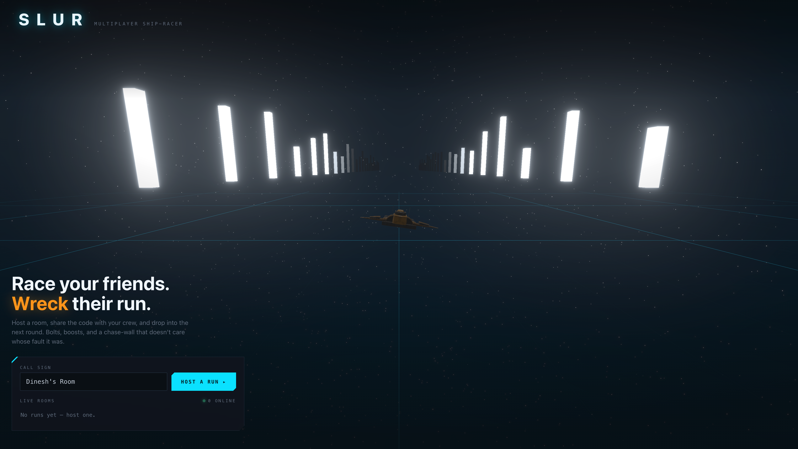

# SLUR

> Casual multiplayer **ship-racer** — play it on the office **LAN** or **hosted on the web**. A party game about *messing with your friends*.

<p align="center">
  
</p>

Player-flown flight down a track in two modes — **Race** (finite, finish-line) and **Survival** (endless, chase-wall). SkyRoads (1993) speed/jump × Blur (2010) pickup-combat × [cuberun](https://github.com/akarlsten/cuberun) neon, in a TRON / Star Trek key. Server-authoritative and **round-based**: the host launches a run and the whole room races together — join a room anytime and race the next round.

## Stack

| Layer | Choice |
|-------|--------|
| Server | Colyseus 0.17 (`@colyseus/schema` 4) |
| Client routing | React Router 8 (framework mode, SPA) |
| Rendering | React Three Fiber 9 + drei + postprocessing |
| Simulation | koota ECS, one shared `simulate()` (60 Hz) |
| Repo | pnpm workspace monorepo · Vite 8 · TypeScript (strict, ESM) |

## Run it

The ship models (`apps/client/public/models/ships/*.gltf`) are **Git-LFS-tracked**. Install and pull LFS
**before** `pnpm install`, or a fresh clone gets pointer text instead of the models and the client dies on
load with a misleading `Unexpected token 'v'` JSON error — not a "missing git-lfs" message.

```sh
git lfs install && git lfs pull   # one-time; fetches the ship models (LFS pointers otherwise)
pnpm install
pnpm dev      # shared (tsc-watch) · server (:2567) · client (:5173)
```

Open http://localhost:5173, host a run, and share the room.

## Docs

- **[docs/](./docs/)** — GDD · TDD · ADD · AUDIO (*what* we're building)
- **[conventions/](./conventions/)** — stack idioms, read-before-touching (*how* we build)
- **[CONTRIBUTING.md](./CONTRIBUTING.md)** — workflow, issues, arc phases
- **[CREDITS.md](./CREDITS.md)** — asset acknowledgments
